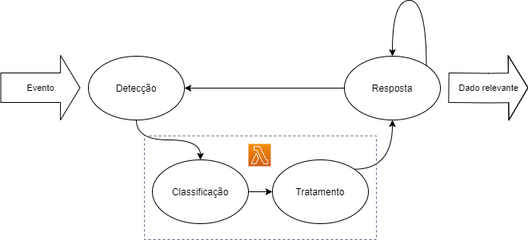

# TESTE ENGENHEIRO DE DADOS

#### SOBRE ESTE REPOSITORIO

Este material é parte do processo de seleção para Engenheiros de Dados na Tembici. Segue a proposta de desafio.

> ###### PARTE 01
> 
> Levando em conta duas fontes de dados sendo: um banco relacional e uma API de stream de dados,
> sua primeira missão será desenhar uma arquitetura orientada a EVENTOS para a ingestão near 
> real-time destes dados em um datalake. Justifique brevemente sua escolha levantando os pontos 
> positivos e negativos da solução.

> ###### PARTE 02
> 
> Seu objetivo é criar um script PYSPARK, que gere um arquivo único de output, utilizando os 3 
> arquivos em csv (station.csv, trip.csv e weather.csv), contendo todos os dados de viagens, 
> acrescidos de:
> 
> - Latitude/Longitude da estação de início e de fim.
> - Uma coluna com o nome "long_trip" de valor booleano sendo 'true' para viagens superiores a 10 minutos.
> - Condição meteorológia no dia da viagem (coluna events da tabela weather).
> - Uma coluna com o nome "age_range" sendo o valor de 1 para pessoas de 0-16 anos, 2 de 17-25, 3 de 26-50 e 4 para 50+.
> 

## Resolução PARTE 01

Este é uma proposta isenta de uma Arquitetura Orientada a Eventos (EDA - Event Driven Architeture) para um contexto de compatilhamento de bicicletas. Não representa uma realidade conhecida pelo autor.

Os seguintes dados na minha percepção fazem parte do contexto de um ou mais banco de dados relacionais:
- Dados de Usuários e Grupos de Usuários
- Dados de Crédito de usuários e Grupos de usuários
- Dados de ativos de mobilidade (bicicletas)
- Dados de reclamação
- Dados de Regiao Geográfica homologada
- Dados de Manutenção

Os seguintes dados na minha percepção fazem parte do contexto de uma API de streaming
- Dados da viagem (Usuário e deslocamento Geo-referenciados na linha do tempo)
- Dados de heath monitoring dos ativos de mobilidade (se aplicável)
- Dados de sensores (acelerometro, movimento, etc.)

Observa-se que os dados de origem API de Streaming podem conter dados duvidosos, assim, Se faz necessario um tratamento da entrada dos dados.

Para verificação e teste da arquitetura, sugiro a utilização de técnicas da Engenharia do Caos, cujo objetivo é verificar a robustes e a tolerância de falhas em ambientes de produção. Ferramentas como Simian Army (Netflix), Gremlin, Mangle, ChaosToolkit e Chaos-Mesh podem apoiar este tipo de avaliação.

## Resolução PARTE 02

Esta resolução levou em conta dois contextos:
- processamento local (Windows)
- processamento em Cluster

Ambos contextos geram uma saída de um arquivo de dados em estrutura colunar (parquet), pois permite uma leitura mais eficiente em relação a processamento e tempo, e também trás benefícios quanto ao tamanho de arquivos.

### Processamento Local
A máquina utilizada possui o Sistema Operacional Windows, onde se faz necessário ter instalado o Python 3 e o Spark conforme tutorial (https://medium.com/big-data-engineering/how-to-install-apache-spark-2-x-in-your-pc-e2047246ffc3).

Toda a sequencia de execução e preparação de dados esta descrita no notebook "/local/desafio2.ipynb". Para executar basta rodar o arquivo "/local/submit_local.bat".

A saída desta execução será um arquivo na pasta "/local/output/trips/", onde será encontrado um arquivo com formato parquet.
 
### Processamento em Cluster
O arquivo "/cluster/AWS.ipynb" contém uma sequencia de configuração dos servidos da Amazon (S3, Group Resource, EMR) para a criação de um cluster Spark On-Demand formado por um Master e dois Slaves.

A execução deste script requer que o Engenheiro de Dados possua uma conta ativa na AWS e que possua configurado localmente o AWS CLI. 

Esta execução pode causar COBRANÇA da AWS pelo uso dos serviços. É necessario observar o tempo de duração dos serviços para não causar prejuízo. Para efeito de referencia, durante os meus testes, a configuração e a utilização do cluster levou no melhor tempo 8 minutos e no pior tempo cerca de 20 minutos.

A saída desta execução será de um arquivo no formato parquet no endereço "s3://tembici-fk/output/trips/".

Foi criado um step no cluster da EMR para a execução do Script Python. A entrada de dados, o script pyspark e a saída parquet todos foram armazenados no bucket S3.

